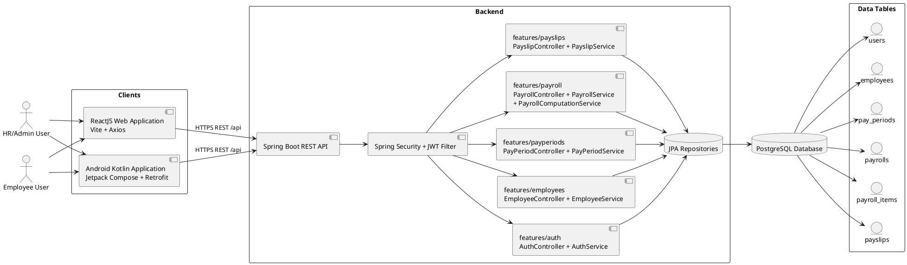

# PayLink Implementation Explanation Report

## Scope

This report summarizes the currently implemented PayLink features across:

- ReactJS web client
- Android Kotlin mobile client
- Spring Boot backend
- PostgreSQL database (via JPA/Flyway)

## Feature 1: Authentication (Register and Login)

### Purpose

Allow users to create an account and sign in, then receive a JWT session for secured API access.

### Frontend / Mobile UI

- ReactJS components:
  - web/src/pages/auth/LoginPage.jsx
  - web/src/pages/auth/RegisterPage.jsx
  - web/src/auth/AuthContext.jsx
- Android screens:
  - mobile/app/src/main/java/edu/cit/sevilla/paylink/mobile/ui/screens/auth/LoginScreen.kt
  - mobile/app/src/main/java/edu/cit/sevilla/paylink/mobile/ui/screens/auth/RegisterScreen.kt

### Spring Boot Components

- Controller: backend/src/main/java/edu/cit/sevilla/paylink/features/auth/api/AuthController.java
- Service: backend/src/main/java/edu/cit/sevilla/paylink/features/auth/application/AuthService.java
- Repositories:
  - backend/src/main/java/edu/cit/sevilla/paylink/repository/UserRepository.java
  - backend/src/main/java/edu/cit/sevilla/paylink/features/employees/infrastructure/EmployeeRepository.java
- Entities:
  - backend/src/main/java/edu/cit/sevilla/paylink/entity/User.java
  - backend/src/main/java/edu/cit/sevilla/paylink/features/employees/domain/Employee.java
- DTOs:
  - backend/src/main/java/edu/cit/sevilla/paylink/features/auth/api/request/LoginRequest.java
  - backend/src/main/java/edu/cit/sevilla/paylink/features/auth/api/request/RegisterRequest.java
  - backend/src/main/java/edu/cit/sevilla/paylink/features/auth/api/response/AuthResponse.java

### API Endpoints

- POST /api/auth/register
- POST /api/auth/login

### Database Tables

- users
- employees

### Flow (User Action to DB Result)

1. User submits register/login form from web or mobile.
2. Client sends HTTP request to /api/auth endpoint.
3. AuthController delegates to AuthService.
4. Register flow stores user + linked employee profile in users and employees.
5. Login flow authenticates credentials and generates JWT.
6. JWT and user profile are returned and stored client-side for future API calls.

### Important Source Files and Responsibilities

- web/src/api/auth.js: React auth API calls.
- web/src/auth/AuthContext.jsx: session storage and auth state.
- mobile/app/src/main/java/edu/cit/sevilla/paylink/mobile/data/repo/AuthRepository.kt: mobile auth orchestration.
- backend/src/main/java/edu/cit/sevilla/paylink/security/SecurityConfig.java: route authorization rules.

---

## Feature 2: Employee Management (HR/Admin)

### Purpose

Allow HR/Admin to view, create, and update employee records.

### Frontend / Mobile UI

- ReactJS component:
  - web/src/pages/hr/HrDashboard.jsx
- Android screen:
  - mobile/app/src/main/java/edu/cit/sevilla/paylink/mobile/ui/screens/dashboard/HrDashboardScreen.kt

### Spring Boot Components

- Controller: backend/src/main/java/edu/cit/sevilla/paylink/features/employees/api/EmployeeController.java
- Service: backend/src/main/java/edu/cit/sevilla/paylink/features/employees/application/EmployeeService.java
- Repository: backend/src/main/java/edu/cit/sevilla/paylink/features/employees/infrastructure/EmployeeRepository.java
- Entity: backend/src/main/java/edu/cit/sevilla/paylink/features/employees/domain/Employee.java
- DTOs:
  - backend/src/main/java/edu/cit/sevilla/paylink/features/employees/api/response/EmployeeDto.java
  - backend/src/main/java/edu/cit/sevilla/paylink/features/employees/api/request/CreateEmployeeRequest.java
  - backend/src/main/java/edu/cit/sevilla/paylink/features/employees/api/request/UpdateEmployeeRequest.java

### API Endpoints

- GET /api/employees
- GET /api/employees/me
- GET /api/employees/{id}
- POST /api/employees
- PUT /api/employees/{id}

### Database Table

- employees

### Flow (User Action to DB Result)

1. Admin opens Employees section in HR dashboard.
2. Client requests employee list (GET /api/employees).
3. Controller calls service; service queries EmployeeRepository.
4. JPA reads employees table rows and maps to EmployeeDto.
5. DTO list is returned to UI; user can create/update entries.

### Important Source Files and Responsibilities

- web/src/api/employees.js: web employee API bindings.
- mobile/app/src/main/java/edu/cit/sevilla/paylink/mobile/ui/screens/dashboard/HrDashboardViewModel.kt: mobile state and employee actions.
- mobile/app/src/main/java/edu/cit/sevilla/paylink/mobile/data/repo/DashboardRepository.kt: mobile employee API calls and error normalization.

---

## Feature 3: Pay Period Management

### Purpose

Define payroll windows (start/end dates) for payroll processing and reporting.

### Frontend / Mobile UI

- ReactJS component:
  - web/src/pages/hr/HrDashboard.jsx
- Android screen:
  - mobile/app/src/main/java/edu/cit/sevilla/paylink/mobile/ui/screens/dashboard/HrDashboardScreen.kt

### Spring Boot Components

- Controller: backend/src/main/java/edu/cit/sevilla/paylink/features/payperiods/api/PayPeriodController.java
- Service: backend/src/main/java/edu/cit/sevilla/paylink/features/payperiods/application/PayPeriodService.java
- Repository: backend/src/main/java/edu/cit/sevilla/paylink/features/payperiods/infrastructure/PayPeriodRepository.java
- Entity: backend/src/main/java/edu/cit/sevilla/paylink/features/payperiods/domain/PayPeriod.java
- DTOs:
  - backend/src/main/java/edu/cit/sevilla/paylink/features/payperiods/api/response/PayPeriodDto.java
  - backend/src/main/java/edu/cit/sevilla/paylink/features/payperiods/api/request/CreatePayPeriodRequest.java

### API Endpoints

- GET /api/pay-periods
- GET /api/pay-periods/{id}
- POST /api/pay-periods
- PATCH /api/pay-periods/{id}/status

### Database Table

- pay_periods

### Flow (User Action to DB Result)

1. Admin creates a new pay period from dashboard form.
2. Client sends POST /api/pay-periods.
3. Service validates date range and saves record.
4. New pay period row is inserted into pay_periods.
5. UI refreshes and selects the newly created period.

### Important Source Files and Responsibilities

- web/src/api/payroll.js: includes pay period API calls.
- mobile/app/src/main/java/edu/cit/sevilla/paylink/mobile/data/network/PayPeriodApi.kt: Retrofit contract for pay periods.

---

## Feature 4: Payroll Processing

### Purpose

Compute payroll for an employee within a selected pay period and store computed amounts.

### Frontend / Mobile UI

- ReactJS component:
  - web/src/pages/hr/HrDashboard.jsx
- Android screen:
  - mobile/app/src/main/java/edu/cit/sevilla/paylink/mobile/ui/screens/dashboard/HrDashboardScreen.kt

### Spring Boot Components

- Controller: backend/src/main/java/edu/cit/sevilla/paylink/features/payroll/api/PayrollController.java
- Services:
  - backend/src/main/java/edu/cit/sevilla/paylink/features/payroll/application/PayrollService.java
  - backend/src/main/java/edu/cit/sevilla/paylink/features/payroll/application/PayrollComputationService.java
- Repositories:
  - backend/src/main/java/edu/cit/sevilla/paylink/features/payroll/infrastructure/PayrollRepository.java
  - backend/src/main/java/edu/cit/sevilla/paylink/features/payroll/infrastructure/PayrollItemRepository.java
- Entities:
  - backend/src/main/java/edu/cit/sevilla/paylink/features/payroll/domain/Payroll.java
  - backend/src/main/java/edu/cit/sevilla/paylink/features/payroll/domain/PayrollItem.java
- DTOs:
  - backend/src/main/java/edu/cit/sevilla/paylink/features/payroll/api/response/PayrollDto.java
  - backend/src/main/java/edu/cit/sevilla/paylink/features/payroll/api/request/ProcessPayrollRequest.java

### API Endpoints

- GET /api/payrolls?payPeriodId={id}
- GET /api/payrolls/me
- GET /api/payrolls/{id}
- POST /api/payrolls/process

### Database Tables

- payrolls
- payroll_items

### Flow (User Action to DB Result)

1. Admin clicks Run Payroll for an employee.
2. Client sends POST /api/payrolls/process.
3. Service validates employee + pay period + uniqueness.
4. PayrollComputationService computes gross, deductions, net.
5. payrolls and payroll_items rows are persisted.
6. Updated payroll list is returned and displayed.

### Important Source Files and Responsibilities

- mobile/app/src/main/java/edu/cit/sevilla/paylink/mobile/data/network/PayrollApi.kt: payroll endpoint mappings.
- mobile/app/src/main/java/edu/cit/sevilla/paylink/mobile/ui/screens/dashboard/HrDashboardViewModel.kt: process payroll actions.

---

## Feature 5: Payslip Generation and Viewing

### Purpose

Generate final payslips from processed payroll and allow HR/employee to view payslip records.

### Frontend / Mobile UI

- ReactJS components:
  - web/src/pages/hr/HrDashboard.jsx
  - web/src/pages/employee/EmployeeDashboard.jsx
- Android screens:
  - mobile/app/src/main/java/edu/cit/sevilla/paylink/mobile/ui/screens/dashboard/HrDashboardScreen.kt
  - mobile/app/src/main/java/edu/cit/sevilla/paylink/mobile/ui/screens/dashboard/EmployeeDashboardScreen.kt

### Spring Boot Components

- Controller: backend/src/main/java/edu/cit/sevilla/paylink/features/payslips/api/PayslipController.java
- Service: backend/src/main/java/edu/cit/sevilla/paylink/features/payslips/application/PayslipService.java
- Repository: backend/src/main/java/edu/cit/sevilla/paylink/features/payslips/infrastructure/PayslipRepository.java
- Entity: backend/src/main/java/edu/cit/sevilla/paylink/features/payslips/domain/Payslip.java
- DTO: backend/src/main/java/edu/cit/sevilla/paylink/features/payslips/api/response/PayslipDto.java

### API Endpoints

- GET /api/payslips?payPeriodId={id}
- GET /api/payslips/me
- GET /api/payslips/{id}
- POST /api/payslips/generate/{payrollId}

### Database Table

- payslips

### Flow (User Action to DB Result)

1. Admin clicks Generate Payslip for processed payroll.
2. Client sends POST /api/payslips/generate/{payrollId}.
3. Service validates payroll status and duplicate payslip rules.
4. New payslip row is inserted to payslips.
5. Employee and HR dashboards query payslip APIs and display records.

### Important Source Files and Responsibilities

- web/src/api/payslips.js: web payslip API bindings.
- mobile/app/src/main/java/edu/cit/sevilla/paylink/mobile/data/network/PayslipApi.kt: mobile payslip endpoints.
- backend/src/main/java/edu/cit/sevilla/paylink/features/payslips/application/PayslipService.java: payslip business constraints.

---

## Feature 6: Role-Based Dashboard Routing and Session Handling

### Purpose

Show different dashboard experiences based on authenticated role (ADMIN vs EMPLOYEE).

### Frontend / Mobile UI

- ReactJS:
  - web/src/App.jsx
  - web/src/auth/ProtectedRoute.jsx
  - web/src/layouts/DashboardLayout.jsx
- Android:
  - mobile/app/src/main/java/edu/cit/sevilla/paylink/mobile/PayLinkMobileApp.kt
  - mobile/app/src/main/java/edu/cit/sevilla/paylink/mobile/data/repo/SessionStore.kt

### Spring Boot Components

- Security:
  - backend/src/main/java/edu/cit/sevilla/paylink/security/SecurityConfig.java
  - backend/src/main/java/edu/cit/sevilla/paylink/security/JwtAuthenticationFilter.java
- Entity/Enum:
  - backend/src/main/java/edu/cit/sevilla/paylink/entity/User.java
  - backend/src/main/java/edu/cit/sevilla/paylink/enums/Role.java

### API and Method Usage

- JWT is issued from POST /api/auth/login and POST /api/auth/register.
- Subsequent API calls include Authorization: Bearer token.

### Database Table

- users

### Flow (User Action to DB Result)

1. User logs in and receives JWT + role.
2. Client stores session and role.
3. Router directs ADMIN to HR dashboard, EMPLOYEE to employee dashboard.
4. Backend validates JWT and role for each secured endpoint.

### Important Source Files and Responsibilities

- web/src/api/client.js: JWT interceptor for React API requests.
- mobile/app/src/main/java/edu/cit/sevilla/paylink/mobile/data/network/NetworkModule.kt: JWT header + API clients.

---

## Testing Result and Screenshot Status

### Automated / Build Verification

- Backend tests: PASS
  - Executed command: mvnw.cmd test
  - Result: BACKEND_TEST_EXIT=0
- Web build: PASS
  - Executed command: npm run build
  - Result: Vite production build completed successfully
- Mobile build: PASS
  - Executed command: gradlew.bat :app:assembleDebug
  - Result: BUILD SUCCESSFUL

### Current test file coverage

- backend/src/test/java/edu/cit/sevilla/paylink/PaylinkApplicationTests.java
  - Contains Spring Boot context-load test
- No dedicated automated integration/UI test suite found yet for web/mobile in the current repository snapshot.

### Screenshots

Please attach the following screenshots in your submission package (not yet generated by this report):

1. Login screen (web and/or mobile)
2. Register screen (web and/or mobile)
3. HR Employees tab with employee list
4. HR Payroll tab showing processed payroll
5. HR Payslips tab showing generated payslip
6. Employee dashboard showing own payroll/payslip data
7. Architecture diagram rendering from the Mermaid section below

---

## System Architecture Diagram

## External Services (Current State)

- No separate third-party API integration layer is implemented in application code.
- Database is hosted externally (Supabase PostgreSQL), consumed through standard PostgreSQL JDBC and JPA.
